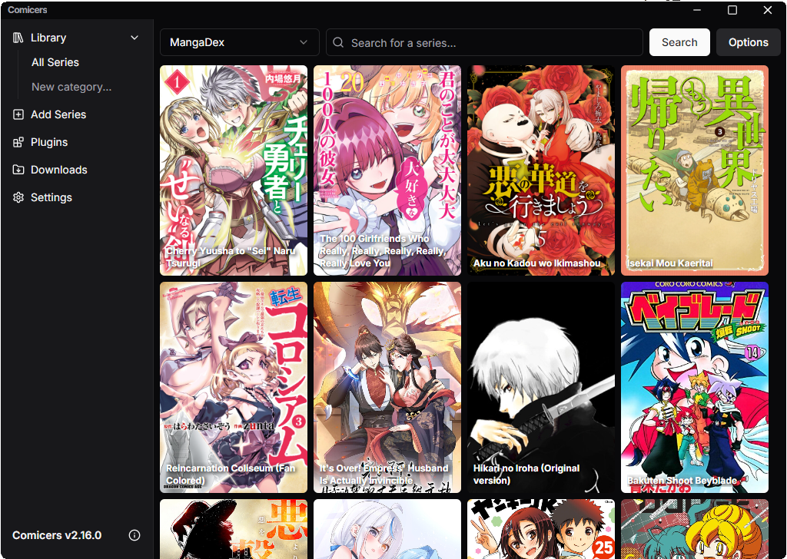

[](https://comicers.org)

[](https://comicers.org)
[](https://github.com/TheFizFactor/Comicers-App/releases)


Comicers is a free and open source manga reader for the desktop.

## Features

- Read manga from popular websites or import ones from your filesystem,
  all in one place.
- Download chapters for offline reading.
- Customizable reader interface with multiple layouts and settings.
- Tagging and filtering support to easily browse and manage large libraries.
- Cross-platform!

## Download

Download Comicers from [the official website](https://comicers.org/download).

Alternatively, you can download manually from the
[GitHub releases page](https://github.com/TheFizFactor/Comicers-App/releases).

## Documentation

User guides and documentation are available on
[comicers.org](https://comicers.org).

## Development

Install dependencies:

```
pnpm i
```

Start the app in the dev environment:

```
pnpm dev
```

## Stack

**Application**: This is an Electron application. The majority of the functionality is performed in the renderer thread. Exceptions are for cases like accessing the window class (i.e. to support minimizing the window), locating application directories, and for working with extensions. The renderer can invoke these functions through ipc.

**UI**: The interface uses React components. Most base components (text, buttons, links, etc.) use [Radix primitives](https://www.radix-ui.com/primitives) and were designed by [shadcn](https://ui.shadcn.com).

**State**: [Recoil](https://recoiljs.org) is used for state management. Hooks are used for small
non-shared behavior.

**Storage**: Library data and settings are saved with `localStorage`. Thumbnails are stored in
the user-data path.

**Plugins/Extensions**: See the [Tiyo](https://github.com/TheFizFactor/tiyo) repo. Dynamic loading is handled by [aki-plugin-manager](https://github.com/TheFizFactor/aki-plugin-manager).

## Content Sources

Comicers allows users to import manga from their filesystem (e.g. as zip files
or folders of images). To read manga from 3rd-party "content sources", the
Tiyo plugin can be installed from the Plugins tab in the client.

To learn about Tiyo or request a new content source, please contact me at fiz@comicers.com

## License

[MIT License](https://github.com/TheFizFactor/Comicers-App/blob/master/LICENSE.txt)
